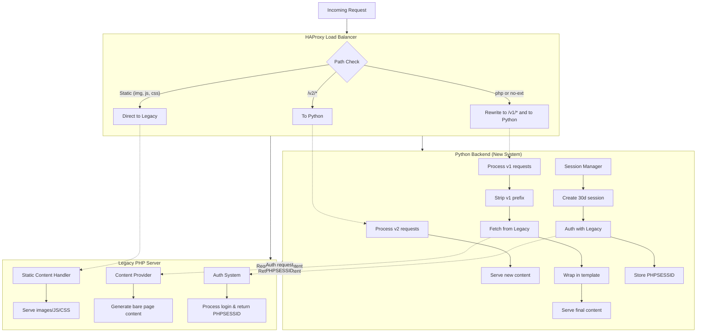

# Hybrid Python-Legacy Website Architecture

## System Overview

This project is a hybrid website system powered by a Python backend that serves both new and legacy content. All requests are routed through **HAProxy**, which determines whether to forward to the new Python backend or preserve access to legacy functionality.

### Request Handling Flow

- **HAProxy**
  - Routes `/v2/*` requests → Python backend
  - Routes any `.php`, `/`, or no-extension (non-static) → `/v1/*` → Python backend
  - Routes static assets (`.jpg`, `.js`, `.css`, etc.) directly to the legacy site

- **Python Backend**
  - Handles `/v2/*` as new functionality
  - Handles `/v1/*` by stripping `v1/`, fetching the old page, wrapping it in the new template, and serving it
  - Content from the legacy site uses a "BARE" template when fetched from the new server. This allows templating in a single location.
  - Manages sessions and logins:
    - Creates a 30-day Python session and cookie
    - Logs into the legacy site and stores PHP session ID
    - Re-authenticates if needed using encrypted credentials in the cookie

## Architecture Diagram





## Setting up the DB
```
sudo dnf install postgres-server 
sudo dnf install -y postgresql16-contrib

postgresql-setup --initdb
systemctl enable postgresql.service
systemctl start postgresql.service
chmod +x ./init/.db.sh
./init/db.sh

sudo -iu postgres psql -d virtual_reports -c "CREATE EXTENSION IF NOT EXISTS pgcrypto;"

  ```

## open the firewall up
```
# 1. Add the postgresql service (or explicit port) permanently
sudo firewall-cmd --zone=public --add-service=postgresql --permanent
# (fallback if service isn’t defined)
sudo firewall-cmd --zone=public --add-port=5432/tcp --permanent

# 2. Reload firewalld to apply
sudo firewall-cmd --reload

# 3. Verify the rule is in place
sudo firewall-cmd --zone=public --list-services
sudo firewall-cmd --zone=public --list-ports
```


vi /var/lib/pgsql/data/postgresql.conf 
listen_addresses = '*'


vi /var/lib/pgsql/data/pg_hba.conf
host    virtual_reports    vr_web_user    0.0.0.0/0    md5

sudo dnf install postgresql-contrib